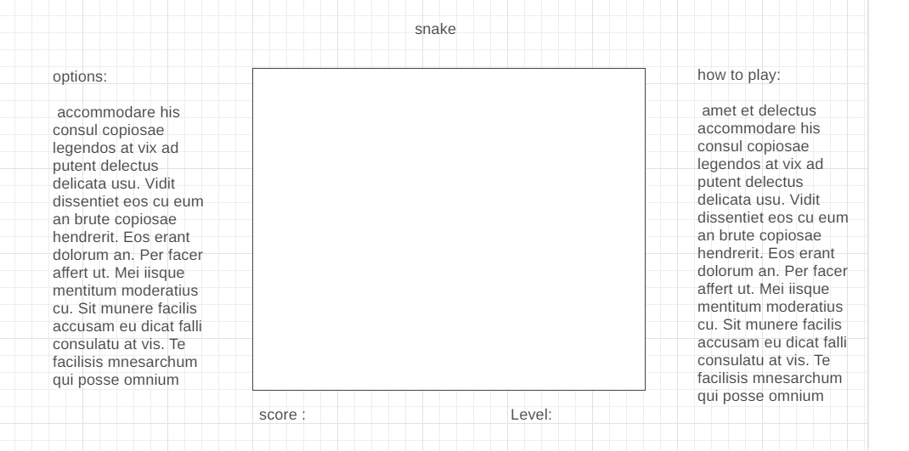

# html
    game title
    score board 
    user score/level
    options board
    game board with id board
    start button
    

# CSS
    set box sizing to border size
    remove all margin and padding
    set hight and weight to VM

    have the body as flex box
        set background color green
        set the game board in the middle,
        set the options on the left hand side
        set the game rules at right hand side 

    set a class snake: 
        inner text is "xx"
        background is "red" 

    set a class food:
        background color : golden
    
    style reset/win button
        only appear when the game is over.
        with dark background 
        
# Javascript
## building the board:
    variable for the score
    variables for the board size
    variable for snake growth
    variable for the snake speed

    run a loop that creates rows, each row with columns based on the variables
    id each div with x,y coordinates 

## draw
     the snake "4 segments" starting the middle of the board

    ## snake movement function:
        - the snake automatically move at speed
        - the user use arrows to change direction the head will move to next
           but only to right and left of the snake. 
           while the snake move vertical right and left arrows change its direction not up/down
           while the snake move horizontal up/down change its direction not left/right
        - snack body follows the head as it moves and does not shift
    
    ## snake eating

        when the head get to a square with food:
          the body grow by growth rate
          the food is eaten
          new food appears
          the score changes
    
    ## snake hitting a wall or eating it self
        if the head of the snake hits a border or body segment the game is over
        a message is displayed that "game over"
        a reset button appears to allow player to restart the game
    
    ##
        

# Open tickets
    none
# closed tickets
 - write the game rules
 - remove console.logs(snake array, food, out of board)
 - remove cells testing boarders and numbering
 - fix the food random number 
 - remove the grids 
 - padding to the game title
 - after game over the screen doesn't show buttons!
 - review restart button function
 - review cancel button function
 - have the snake head looks special
 - winning function:
    - add max score 
    - add to the score board declaration of max score
    - add winning function  
 - improve the cute snake logo
 - game over if the snake eat itself
 - style the food to be flashing.
 - next level fixes: 
    - should not go to restart/cancel screen"
    - score  to continue and not restarts from 0
    - speed need to go up 
 - win / next level buttons
 - add speed to the game board 
 - test for responsive design
 - deploy on github pages
    - apply github suggested structure of files
    - rename JS,CSS files.
    - relink files to html
- add remarks within the js code
- responsive design

# future ideas for enhancements:  
- add touch as input for snake movement
   - create the game options (multiple items)
    - control snake speed
    - control level
- add sound effects

