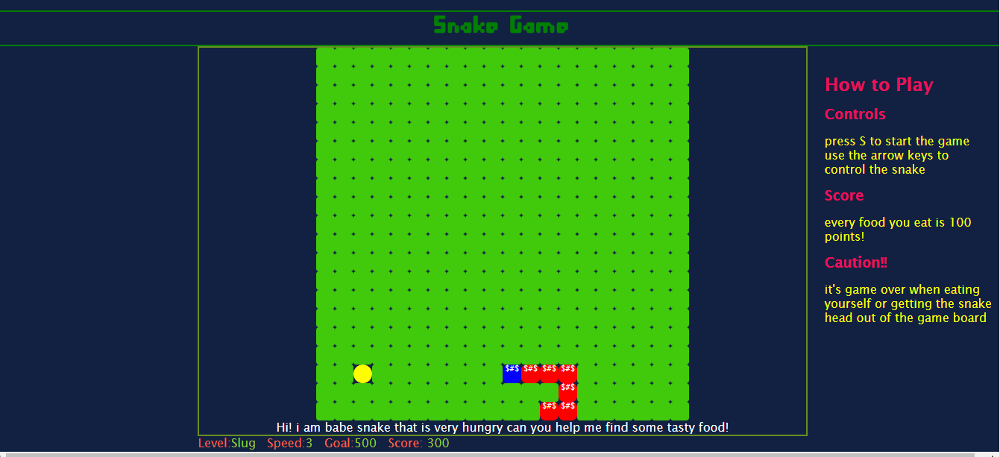
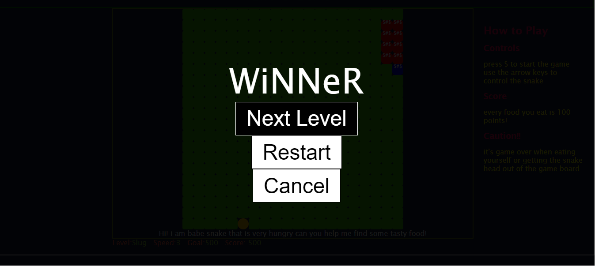

# Snake Game

This game is based on the popular back in the days snake game that was on Nokia mobile phones.  
During the game, the player is directing a moving snake toward food items shown on the board, while trying to avoid having the snake going out of the play board or into itself.  As the snake eats food it grows longer and the score increments. Once the score reachs a goal score, the player can choose to go to next level where the snake moves faster which is more challenging. 

# Screenshots of the game

The game starts by a welcome screen:   

 

when the player press "s" the game starts: here is during playing the snake head is blue, the body is red, the food is yellow flashing circle. 

if the play achieve the goal score (displayed in the bottom of the game board); they are offered to either go to next level, restart the game or cancel(which is to see where they are at in the game)

if the snake get out of the board or eats itself a game over message is displayed

# Technologies Used
HTML, CSS, JS 
Jquery

# The game is playable at:

github-pages: [View deployment](https://heshamshaarawy.github.io/SnakeGame/)

# Next Steps: Planned future enhancements (icebox items).
 
These are some of the ideas for leveling up the game:

 - Add touch-screen as input for snake movement; so that the game can be played on touch-screen devices

- Enable user to change the game options like:
    - change the snake speed.
    - change styles of the game.
- have gaming enhancements like:
    - poison food when the snake eat, its game-over.
    - enable holes where the snake goes into one and come out of the other
- Add Sound effects

